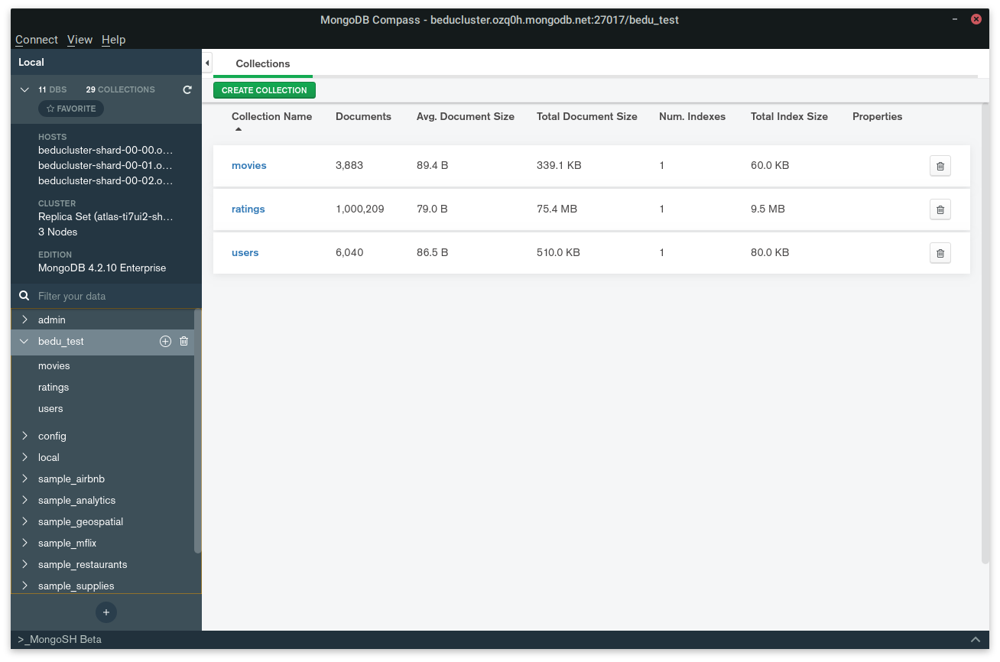
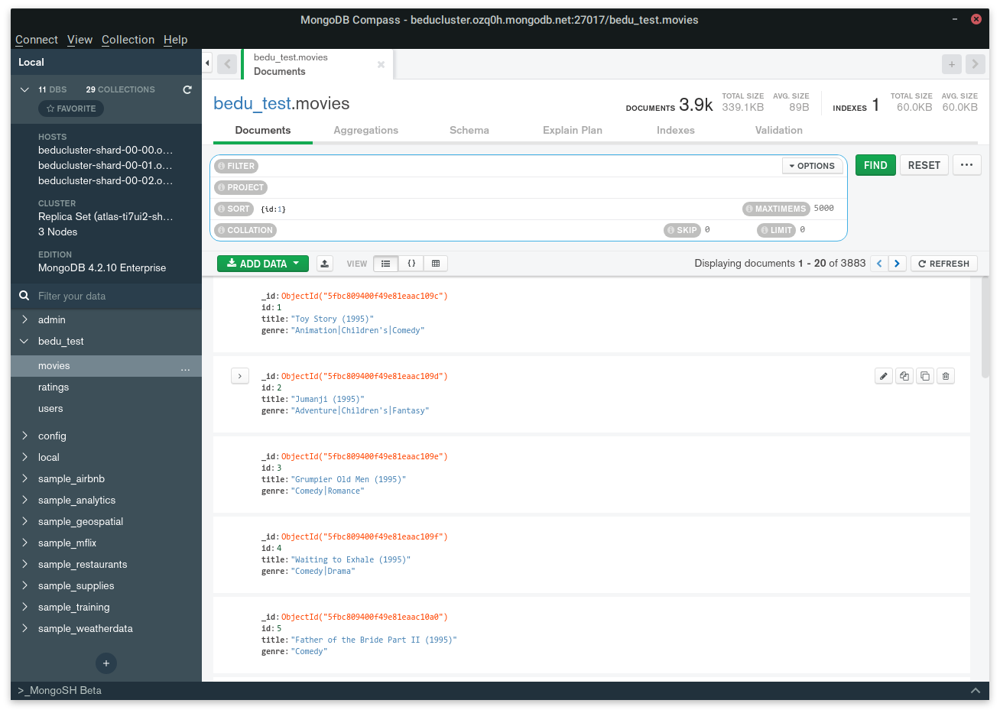
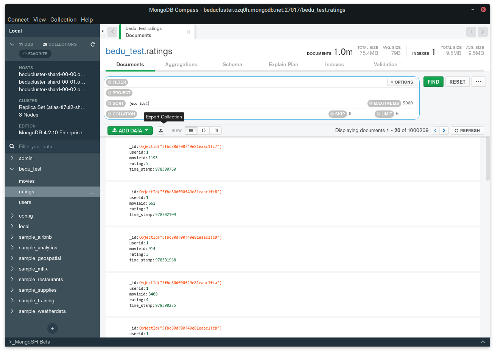
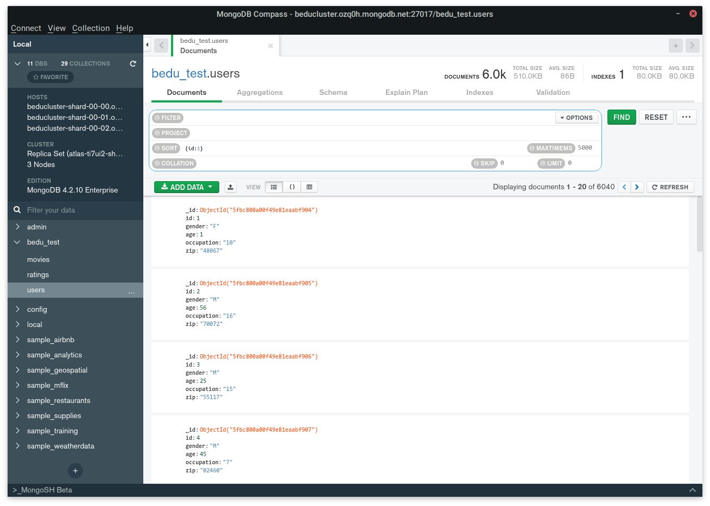

# Evidencias de Work Sesión 7
---
> Alan Kevin Fuentes García \
> Data Science - BEDU \
> Introducción a las Bases de Datos
## Reto 1
Creamos las estructuras de todas las tablas que usaremos para las importaciones de los datos.

```sql
create table if not exists movies (
    id int primary key,
    title varchar(100),
    genre varchar(50)
);

create table if not exists ratings (
   userid int, 
   movieid int, 
   rating int, 
   time_stamp bigint
);

create table if not exists users (
	id int primary key,
	gender varchar(2),
	age int,
	occupation int,
	zip char(5)
);
```
## Reto 2
### Tabla `users`
Partimos de los datos del archivo `users.dat` que se transforman a `users.csv` con separador `,`.

```
id,gender,age,occupation,zip
1,F,1,10,48067
2,M,56,16,70072
3,M,25,15,55117
4,M,45,7,02460
5,M,25,20,55455
6,F,50,9,55117
7,M,35,1,06810
8,M,25,12,11413
9,M,25,17,61614
10,F,35,1,95370
...
```

Después de importar los registros a la base de datos. Hacemos una consulta para verificar la existencia de 5 elementos después de los primeros 3000.

```sql
select * from users limit 5 offset 3000;
```

El resultado en DBeaver arroja un formato de tabla interpretable por markdown:

|id  |gender|age|occupation|zip  |
|----|------|---|----------|-----|
|3037|F     | 25|         2|97333|
|3038|F     | 35|         2|97401|
|3039|F     | 50|         3|33611|
|3040|M     | 25|         8|22046|
|3041|M     | 25|         4|97333|

Contamos el número total de registros:

```sql
select count(*) from users;
```

|count(*)|
|--------|
|    5959|

### Tabla `ratings`
Partimos de los datos del archivo `ratings.dat` que se transforman a `ratings.csv` con separador `,`.
```
userid,movieid,rating,time_stamp
1,1193,5,978300760
1,661,3,978302109
1,914,3,978301968
1,3408,4,978300275
1,2355,5,978824291
1,1197,3,978302268
1,1287,5,978302039
1,2804,5,978300719
1,594,4,978302268
1,919,4,978301368
1,595,5,978824268
1,938,4,978301752
...
```

Después de importar los registros a la base de datos. Hacemos una consulta para verificar la existencia de 5 elementos después de los primeros 3000.

```sql
select * from ratings limit 5 offset 3000;
```

El resultado en DBeaver arroja un formato de tabla interpretable por markdown:

|userid|movieid|rating|time_stamp|
|------|-------|------|----------|
|    23|   2268|     3| 978462452|
|    23|   1396|     4| 978464461|
|    23|   2912|     3| 978462555|
|    23|    866|     4| 978462330|
|    23|   2916|     5| 978464019|

Contamos el número total de registros:

```sql
select count(*) from ratings;
```

|count(*)|
|--------|
| 1000209|

### Tabla `movies`
Partimos de los datos del archivo `movies.dat` que se transforman a `movies.csv` con separador `;`.

```
id;title;genre
1;Toy Story (1995);Animation|Children's|Comedy
2;Jumanji (1995);Adventure|Children's|Fantasy
3;Grumpier Old Men (1995);Comedy|Romance
4;Waiting to Exhale (1995);Comedy|Drama
5;Father of the Bride Part II (1995);Comedy
6;Heat (1995);Action|Crime|Thriller
7;Sabrina (1995);Comedy|Romance
8;Tom and Huck (1995);Adventure|Children's
9;Sudden Death (1995);Action
10;GoldenEye (1995);Action|Adventure|Thriller
11;American President, The (1995);Comedy|Drama|Romance
12;Dracula: Dead and Loving It (1995);Comedy|Horror
```

Después de importar los registros a la base de datos. Hacemos una consulta para verificar la existencia de 5 elementos después de los primeros 3000.

```sql
select * from movies limit 5 offset 3000;
```

El resultado en DBeaver arroja un formato de tabla interpretable por markdown:

id  |title                                                             |genre                  |
----|------------------------------------------------------------------|-----------------------|
3069|Effect of Gamma Rays on Man-in-the-Moon Marigolds, The (1972)     |Drama                  |
3070|Adventures of Buckaroo Bonzai Across the 8th Dimension, The (1984)|Adventure|Comedy|Sci-Fi|
3071|Stand and Deliver (1987)                                          |Drama                  |
3072|Moonstruck (1987)                                                 |Comedy                 |
3073|Sandpiper, The (1965)                                             |Drama|Romance          |

Contamos el número total de registros:

```sql
select count(*) from movies;
```
|count(*)|
|--------|
|    3883|
## Reto 3
Partiendo de los mismos archivos, la carga en una base de datos MongoDB resultó en las siguientes cifras:



Hacemos pruebas corresopndientes para cada colección:

* `movies`:


* `ratings`:


* `users`:


Se pudo hacer la carga exitosa. Como DBeaver omitió algunas entradas con ID repetidos, en Mongo existen más documentos que registros en SQL.